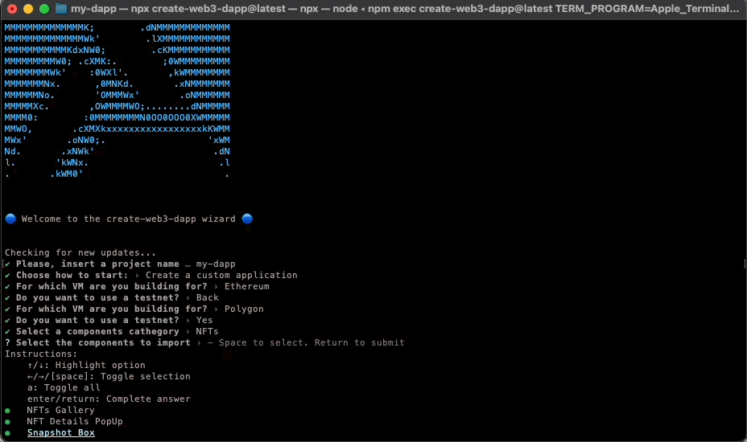

# Create Web3 DApp

[![Stargazers][stars-shield]][stars-url] [![Forks][forks-shield]][forks-url]
[![Contributors][contributors-shield]][contributors-url]
[![Issues][issues-shield]][issues-url]
[![MIT License][license-shield]][license-url]

<!--  -->
   Everything you need to create Web3 Dapps.

-   [Creating an App](#creating-an-app) – How to create a new app.
-   [Docs](https://docs.alchemy.com/create-web3-dapp) – How to develop apps bootstrapped with Create Web3 Dapp

Create Web3 DApp works on macOS, Windows, and Linux.<br>
If something doesn’t work, please [file an issue](https://github.com/alchemyplatform/create-web3-dapp/issues/new).<br>
If you have questions or need help, please ask in [GitHub Discussions](https://github.com/alchemyplatform/create-web3-dapp/discussions).


## About The Project

create-web3-dapp is an npx package that allows developers to **create any web3 application** in ~2 minutes.

The create-web3-dapp package is a NextJS-based framework, **compatible with the most used blockchains such as Ethereum, Polygon, Optimism, Arbitrum, and Solana**, that helps web3 developers build production-ready  decentralized applications at lightning speed, using pre-made React components, webhooks, and APIs.

## Quick Overview

```sh
npx create-web3-dapp@latest
cd my-dapp
npm run dev
```

If you've previously installed `create-web3-dapp` globally via `npx create-web3-dapp`, the CLI builder will notify you if a new version has been released. In any case, we always suggest you to run using the latest available version by running `npx create-web3-dapp@latest`.

_([npx](https://medium.com/@maybekatz/introducing-npx-an-npm-package-runner-55f7d4bd282b) comes with npm 5.2+ and higher, see [instructions for older npm versions](https://gist.github.com/gaearon/4064d3c23a77c74a3614c498a8bb1c5f))_

Then open [http://localhost:3000/](http://localhost:3000/) to see your app.<br>




### Get Started Immediately

You **don’t** need to install or configure tools like Rainbowkit, Phantom connect, Hardhat, or Anchor<br>
They will be automatically added and preconfigured for you to focus on the code.

Create a new project, and you’re good to go.

## Creating an App

**You’ll need to have Node 14.0.0 or later version on your local development machine** (but it’s not required on the server). We recommend using the latest LTS version. You can use [nvm](https://github.com/creationix/nvm#installation) (macOS/Linux) or [nvm-windows](https://github.com/coreybutler/nvm-windows#node-version-manager-nvm-for-windows) to switch Node versions between different projects.

To create a new app, go through the following steps:

1. In your terminal run:

```sh
  npx create-web3-dapp@latest
```

2. Select the dependencies and components you want to include in your web3 application:
   ![product-screenshot-2]


It will create a directory called with the given name inside the current folder.<br>

Inside that directory, Create Web3 Dapp it will generate the initial project structure and install the needed dependencies:

### Folder Structure

Without Blockchain Development Environment
```
my-dapp
├── README.md
├── node_modules
├── package.json
├── .gitignore
├── public
│   ├── favicon.ico
│   ├── index.html
│   └── manifest.json
└── src
    ├── App.css
    ├── App.js
    ├── App.test.js
    ├── index.css
    ├── index.js
    ├── logo.svg
    └── serviceWorker.js
    └── setupTests.js
```

With Blockchain Development Environment
```
my-dapp
├── README.md
├── node_modules
├── package.json
├── .gitignore
├── public
│   ├── favicon.ico
│   ├── index.html
│   └── manifest.json
└── src
    ├── App.css
    ├── App.js
    ├── App.test.js
    ├── index.css
    ├── index.js
    ├── logo.svg
    └── serviceWorker.js
    └── setupTests.js
```

No configuration or complicated folder structures, only the files you need to build your Dapp.<br>
Once the installation is done, you can open your project folder:

```sh
cd my-dapp
```
And, in case you've installed a blockchain development environment, navigate to the frontend folder.

Inside the newly created project, you can run some built-in commands:

`npm run dev`

Runs the app in development mode.<br>
Open [http://localhost:3000](http://localhost:3000) to view it in the browser.

The page will automatically reload if you make changes to the code.<br>
You will see the build errors and lint warnings in the console.


## User Guide

You can find detailed instructions on using Create Web3 DApp and many tips in [its documentation](https://docs.alchemy.com/create-web3-dapp).

## Philosophy

-   **One Dependency:** There is only one build dependency. It uses webpack, Babel, ESLint, and other amazing projects, but provides a cohesive curated experience on top of them.

-   **No Configuration Required:** You don't need to configure anything. A reasonably good configuration of both development and production builds is handled for you so you can focus on writing code.

-   **No Lock-In:** You can “eject” to a custom setup at any time. Run a single command, and all the configuration and build dependencies will be moved directly into your project, so you can pick up right where you left off.

## What’s Included?

Your environment will have everything you need to build a dapp:

-  NextJS, React, Alchemy Enhanced APIs, Alchemy SDK, Rainbowkit, Wagmi
-   Hassle-free updates for the above tools with a single dependency.

Check out [this guide (coming soon)]() to learn how to build with Create Web3 Dapp.

Check out [this guide (coming soon)]() for an overview of the full overview of the code base.


## Popular Alternatives

Create Web3 Dapp is a great fit for:

-   **Learning Web3** in a comfortable and feature-rich development environment.
-   **Starting new Web3 Applications**
-   **Creating examples and experiment** with React for your libraries and components.

Here are a few common cases where you might want to try something else:

-   If you want to **try React** without hundreds of transitive build tool dependencies, consider [using a single HTML file or an online sandbox instead](https://reactjs.org/docs/getting-started.html#try-react).

-   If you need to **integrate React code with a server-side template framework** like Rails, Django or Symfony, or if you’re **not building a single-page app**, consider using [nwb](https://github.com/insin/nwb), or [Neutrino](https://neutrino.js.org/) which are more flexible. For Rails specifically, you can use [Rails Webpacker](https://github.com/rails/webpacker). For Symfony, try [Symfony's webpack Encore](https://symfony.com/doc/current/frontend/encore/reactjs.html).

-   If you need to **publish a React component**, [nwb](https://github.com/insin/nwb) can [also do this](https://github.com/insin/nwb#react-components-and-libraries), as well as [Neutrino's react-components preset](https://neutrino.js.org/packages/react-components/).

-   If you want to do **server rendering** with React and Node.js, check out [Next.js](https://nextjs.org/) or [Razzle](https://github.com/jaredpalmer/razzle). Create React App is agnostic of the backend, and only produces static HTML/JS/CSS bundles.

-   If your website is **mostly static** (for example, a portfolio or a blog), consider using [Gatsby](https://www.gatsbyjs.org/) or [Next.js](https://nextjs.org/). Unlike Create React App, Gatsby pre-renders the website into HTML at build time. Next.js supports both server rendering and pre-rendering.

-   Finally, if you need **more customization**, check out [Neutrino](https://neutrino.js.org/) and its [React preset](https://neutrino.js.org/packages/react/).

All of the above tools can work with little to no configuration.

If you prefer configuring the build yourself, [follow this guide](https://reactjs.org/docs/add-react-to-a-website.html).

## Alchemy

Looking for something similar, but for React Native?<br>
Check out [Expo CLI](https://github.com/expo/expo-cli).

## Contributing

We'd love to have your helping hand on `create-web3-dapp`! See [CONTRIBUTING.md](CONTRIBUTING.md) for more information on what we're looking for and how to get started.

## Supporting Create Web3 DApp

Create Web3 DApp is a community maintained project and all contributors are volunteers. If you'd like to support the future development of Create React App then please consider donating to our [Open Collective](https://opencollective.com/create-react-app).

## Credits

This project exists thanks to all the people who [contribute](CONTRIBUTING.md).<br>

<a href="https://github.com/alchemyplatform/Create-web3-dapp/graphs/contributors">
  
</a>

## Acknowledgements

We are grateful to the authors of existing related projects for their ideas and collaboration:

-   [@vittorivabella](https://github.com/eversmile12)
-   [@alberthu](https://github.com/thatguyintech)

## License

Create React App is open source software [licensed as GNU-AGPL](https://github.com/alchemyplatform/create-web3-dapp/blob/main/LICENSE). 

[contributors-shield]: https://img.shields.io/github/contributors/eversmile12/create-web3-dapp.svg?style=for-the-badge
[contributors-url]: https://github.com/eversmile12/create-web3-dapp/graphs/contributors
[forks-shield]: https://img.shields.io/github/forks/eversmile12/create-web3-dapp.svg?style=for-the-badge
[forks-url]: https://github.com/eversmile12/create-web3-dapp/network/members
[stars-shield]: https://img.shields.io/github/stars/eversmile12/create-web3-dapp.svg?style=for-the-badge
[stars-url]: https://github.com/eversmile12/create-web3-dapp/stargazers
[issues-shield]: https://img.shields.io/github/issues/eversmile12/create-web3-dapp.svg?style=for-the-badge
[issues-url]: https://github.com/eversmile12/create-web3-dapp/issues
[license-shield]: https://img.shields.io/github/license/eversmile12/create-web3-dapp.svg?style=for-the-badge
[license-url]: https://github.com/eversmile12/create-web3-dapp/blob/master/LICENSE.txt
[linkedin-shield]: https://img.shields.io/badge/-LinkedIn-black.svg?style=for-the-badge&logo=linkedin&colorB=555
[product-screenshot]: images/screenshot.png
[product-screenshot-2]: images/screenshot_2.png
