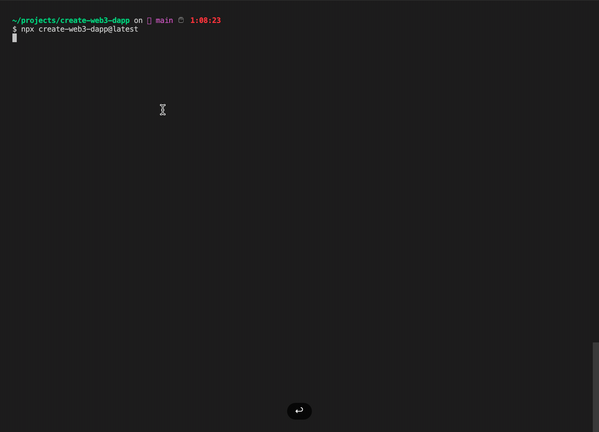

# Create Web3 DApp
<p align="center">
    <br />
    <a href="https://createweb3dapp.alchemy.com">
        </a>
    <br />
</p>

<h1 align="center"><a href='https://createweb3dapp.alchemy.com/'>create-web3-dapp</a> </h1>
<p align="center"><strong>Everything you need to create Web3 Dapps in 4 minutes.
</strong></p>


<center>

[![Stargazers][stars-shield]][stars-url] [![Forks][forks-shield]][forks-url]
[![Contributors][contributors-shield]][contributors-url]
[![Issues][issues-shield]][issues-url]
[![MIT License][license-shield]][license-url]

</center>


This package includes the global command to start the Create Web3 DApp CLI builder.

Please refer to this package's documentation and the following links for an in depth explanation:

-   [Docs](https://docs.alchemy.com/docs/create-web3-dapp) - Everything you need to know when using CW3D
-   [GitHub](https://github.com/alchemyplatform/create-web3-dapp) - look at the extensive code example or start contributing
-   [Website](https://createweb3dapp.alchemy.com) - Learn more about CW3D and add components to your project
-   [Templates](https://createweb3dapp.alchemy.com/#templates) - Check out the pre-built project templates
-   [Components Library](https://createweb3dapp.alchemy.com/#components) - Add features directly to your project through components
-   [Examples](https://github.com/alchemyplatform/create-web3-dapp-examples) - See the components implemented in a real world dapp
-   [Community](https://t.me/createweb3dapp) - Meet other builders, get support, and give feedback!

<p align"center">🟡 No need to clone: run "npx create-web3-dapp@latest" in your terminal to get started</p>

</br>

## What's included?
Your environment will have everything you need to start building a dapp:

- [x] Next.js
- [x] Wagmi Hooks
- [x] Ethers.js
- [x] Rainbowkit
- [x] Alchemy SDK

</br>


## Supported chains
With create-web3-dapp you can create multi-chain dapps supporting all of the major EVM based chains:

- [x] Ethereum
- [x] Polygon
- [x] Polygon zkEVM
- [x] Arbitrum
- [x] Optimism

Support for non EVM chains is in the roadmap

</br>


## What is create-web3-dapp?

create-web3-dapp is an npx tool that allows developers to **create web3 applications in ~4 minutes.**

The dapp created with create-web3-dapp are NextJS-based, and **compatible with the most used blockchains such as Ethereum, Polygon, Optimism, Arbitrum, and Solana**. Create-web3-dapp allows web3 developers to build production-ready decentralized applications at lightning speed, using pre-made React components, webhooks, and APIs.

No complicated configuration or folder structures, only the files you need to build your Dapp.




</br>


## Philosophy

-   **One Dependency:** There is only one build dependency. It uses webpack, Babel, ESLint, and other amazing projects, but provides a cohesive curated experience on top of them.

-   **No Configuration Required:** You don't need to configure anything. A reasonably good configuration of both development and production builds is handled for you so you can focus on writing code.

-   **No Lock-In:** You can “eject” to a custom setup at any time. Run a single command, and all the configuration and build dependencies will be moved directly into your project, so you can pick up right where you left off.


## When to use CW3D

Create web3 dapp is a great fit for:

-   **Learning Web3** in a comfortable and feature-rich development environment.
-   **Starting new Web3 Applications**
-   **Testing things and experiment** with React for your libraries and components.


## Usage

```
npx create-web3-dapp@latest
```

If you've previously installed `create-web3-dapp` globally via `npx create-web3-dapp`, the CLI builder will notify you if a new version has been released. In any case, we suggest you to run using the latest available version by running `npx create-web3-dapp@latest`.

_([npx](https://medium.com/@maybekatz/introducing-npx-an-npm-package-runner-55f7d4bd282b) comes with npm 5.2+ and higher, see [instructions for older npm versions](https://gist.github.com/gaearon/4064d3c23a77c74a3614c498a8bb1c5f))_


</br>

## Quick Start

To create a new app:

1. In your terminal run:

```sh
  npx create-web3-dapp@latest
```

2. Select and create the dependencies, components, and contracts you want to include in your web3 application.

Create web3 dapp will then create a directory containing the files to kickstart your project and install the install dependencies you'll need<br>

```sh
npx create-web3-dapp@latest
cd my-create-web3-dapp
npm run dev
```

In case you've installed a blockchain development environment, navigate to the frontend folder before running npm run dev.

Now navigate on [http://localhost:3000/](http://localhost:3000/) to see your dapp.<br>

Next, learn how to add a web3 ready component from the create-web3-dapp library.


</br>

## Smart Contracts Backpack - CLI Smart Contract creator

Create web3 dapp doesn't only set up your blockchain development environment, that to the built-in smart contracts backpack it also allows to create fully fledged Solidity Smart Contracts directly from the CLI.

<p><strong>Note: </strong>This will work only if you have installed a blockchain development environment</p>

The smart contracts backpack can create audited smart contracts, deployment scripts and tests, of one of the following standards:

-   **ERC721:** NFT collection smart contract
-   **ERC20:** Crypto currency smart contract
-   **ERC1155:** Fungibility agnosting smart contract

Learn more on how to create, build and deploy, the smart contracts backpack in the [docs](https://docs.alchemy.com/docs/build-and-deploy-smart-contracts).


</br>

## Web3 React Components Library

Create web3 dapp allows developers to prototype their dapps in minutes thanks to a full library of responsive, production ready, [web3 React components](https://createweb3dapp.alchemy.com).

<p><strong>Note: </strong>The components work best inside create-web3-dapp projects, but are compatible with any NextJS project.</p>

Use the following links to **learn how to implement the components in the library**:

-   [Docs](https://docs.alchemy.com/docs/create-web3-dapp-components): a brokendown guide for every component
-   [Github](https://github.com/alchemyplatform/create-web3-dapp-examples): see the components implemented in a real-world project

</br>


</br>

## Example implementation:

1. In /components create nftCreator.jsx
2. In/styles create NftCreator.module.css
3. In /pages/apicreatepinFileToIpfs.jspinJsonToIpfs.js
4. Copy the corresponding code below into each of the created files above.
5. Import the NftCreator component at the top of your page:

</br>

```tsx
import styles from "../styles/Home.module.css";
import NftCreator from "../components/nft-creator";
import contract from "../abis/smartContractAbi.json";

export default function Home() {
	return (
		<div>
			<main className={styles.main}>
				<NftCreator
					abi={contract.abi}
					contractAddress={
						"0x9FaCAf075Cda7C0947DA0F0B4164332e01422E97"
					}
				/>
			</main>
		</div>
	);
}
```

More components? Check detailed instructions on the [Docs]().


</br>

## Dapp Templates Library

Create web3 dapp gives you access to a library of production ready, web3 applications to kickstart your project with. NFTs Explorer, and much more coming soon.

The templates are available for developers to use as is, or they can be customized to fit the needs of their particular project.

<p><strong>Note: </strong>keeping dependencies to the minimum, and the code lean is our top priority, this to grant the templates, full customisability.</p>

Use the following links to **learn how to kickstart your dapp using the templates library**:

-   [Templates Docs](https://docs.alchemy.com/docs/create-web3-dapp-templates)
-   [Templates Library](https://createweb3dapp.alchemy.com/#templates)
-   Github(coming soon)

</br>


</br>


</br>

## Folder Structure

create-web3-dapp has two folders structures, based on the presence of a blockchain development environment, or not.

### With Blockchain Development Environment

```
📦Root
 ┣ 📂components
 ┃ ┣ 📂navigation
 ┃ ┃ ┗ 📜navbar.jsx
 ┃ ┗ 📜InstructionsComponent.jsx
 ┣ 📂layout
 ┃ ┗ 📜mainLayout.jsx
 ┣ 📂pages
 ┃ ┣ 📂api
 ┃ ┣ 📜_app.js
 ┃ ┗ 📜index.jsx
 ┣ 📂public
 ┃ ┗ 📜alchemy_logo.svg
 ┣ 📂styles
 ┃ ┣ 📜Home.module.css
 ┃ ┣ 📜Navbar.module.css
 ┃ ┣ 📜InstructionsComponent.module.css
 ┃ ┗ 📜globals.css
 ┣ 📜.env.local
 ┣ 📜.gitignore
 ┣ 📜next.config.js
 ┣ 📜package-lock.json
 ┗ 📜package.json

```

### Without Blockchain Development Environment

```
📦Root
 ┣ 📂.vscode
 ┃ ┗ 📜settings.json
 ┣ 📂backend
 ┃ ┣ 📂contracts
 ┃ ┃ ┗ 📜MyContract.sol
 ┃ ┣ 📂scripts
 ┃ ┃ ┗ 📜MyContract_deploy.js
 ┃ ┣ 📂test
 ┃ ┃ ┗ 📜Lock.js
 ┃ ┣ 📜.env.local
 ┃ ┣ 📜hardhat.config.js
 ┃ ┣ 📜package-lock.json
 ┃ ┗ 📜package.json
 ┣ 📂frontend
 ┃┣ 📂components
 ┃ ┃┣ 📂navigation
 ┃ ┃ ┗ 📜navbar.jsx
 ┃  ┃┗ 📜InstructionsComponent.jsx
 ┃┣ 📂layout
 ┃┃ ┗ 📜mainLayout.jsx
 ┃┣ 📂pages
 ┃┃ ┣ 📂api
 ┃┃ ┣ 📜_app.js
 ┃┃ ┗ 📜index.jsx
 ┃┣ 📂public
 ┃┃ ┗ 📜alchemy_logo.svg
 ┃┣ 📂styles
 ┃┃ ┣ 📜Home.module.css
 ┃┃ ┣ 📜Navbar.module.css
 ┃┃ ┣ 📜InstructionsComponent.module.css
 ┃┃ ┗ 📜globals.css
 ┃┣ 📜.env.local
 ┃┣ 📜.gitignore
 ┃┣ 📜next.config.js
 ┃ ┣ 📜package-lock.json
 ┃ ┗ 📜package.json
 ┣ 📜.DS_Store
 ┣ 📜.env.local
 ┣ 📜.gitignore
 ┣ 📜LICENSE
 ┗ 📜README.md
```


## Contributing

We'd love to have your helping hand on `create-web3-dapp`! See [contributing.md](/contributing.md) for more information on what we're looking for and how to get started.

## Supporting Create Web3 DApp

Create Web3 DApp is a community maintained project and all contributors are volunteers. If you'd like to support the future development of Create React App then please consider donating to our [Open Collective](https://opencollective.com/create-react-app).


## Tools to try with create web3 dapp:

- coming soon - partners.

</br>

## Credits

This project exists thanks to all the people who [contribute](/contributing.md).<br>

<a href="https://github.com/alchemyplatform/Create-web3-dapp/graphs/contributors">
  
</a>

</br>

## Maintainers

-   [@vittorivabella](https://github.com/eversmile12)

</br>

## License

Create React App is open source software [licensed as GNU-AGPL](https://github.com/alchemyplatform/create-web3-dapp/blob/main/LICENSE).

[contributors-shield]: https://img.shields.io/github/contributors/eversmile12/create-web3-dapp.svg?style=for-the-badge
[contributors-url]: https://github.com/eversmile12/create-web3-dapp/graphs/contributors
[forks-shield]: https://img.shields.io/github/forks/eversmile12/create-web3-dapp.svg?style=for-the-badge
[forks-url]: https://github.com/eversmile12/create-web3-dapp/network/members
[stars-shield]: https://img.shields.io/github/stars/eversmile12/create-web3-dapp.svg?style=for-the-badge
[stars-url]: https://github.com/eversmile12/create-web3-dapp/stargazers
[issues-shield]: https://img.shields.io/github/issues/eversmile12/create-web3-dapp.svg?style=for-the-badge
[issues-url]: https://github.com/eversmile12/create-web3-dapp/issues
[license-shield]: https://img.shields.io/github/license/eversmile12/create-web3-dapp.svg?style=for-the-badge
[license-url]: https://github.com/eversmile12/create-web3-dapp/blob/master/LICENSE.txt
[linkedin-shield]: https://img.shields.io/badge/-LinkedIn-black.svg?style=for-the-badge&logo=linkedin&colorB=555
[product-screenshot]: images/screenshot.png
[product-screenshot-2]: images/screenshot_2.png

