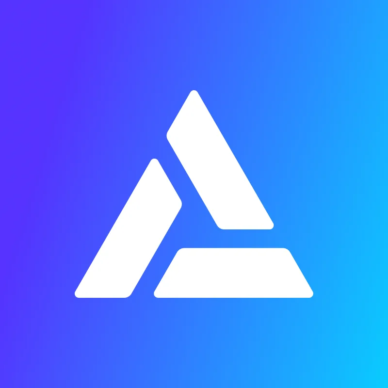

<div id="top"></div>

[![Contributors][contributors-shield]][contributors-url]
[![Forks][forks-shield]][forks-url]
[![Stargazers][stars-shield]][stars-url]
[![Issues][issues-shield]][issues-url]
[![MIT License][license-shield]][license-url]

<!-- PROJECT LOGO -->
<br />
<div align="center">
  <a href="https://github.com/eversmile12/create-web3-dapp">
    
  </a>

<h2 align="center">create-web3-dapp</h2>

  <p align="center">
    Everything you need to build decentralized applications
    <br />
    <a href="https://docs.alchemy.com"><strong>Explore the docs »</strong></a>
    <br />
    <br />
    <a href="https://github.com/eversmile12/create-web3-dapp">Contribute</a>
    ·
    <a href="https://github.com/eversmile12/create-web3-dapp/issues">Report Bug</a>
    ·
    <a href="https://github.com/eversmile12/create-web3-dapp/issues">Request Feature</a>
  </p>
</div>

<!-- TABLE OF CONTENTS -->
<details>
  <summary>Table of Contents</summary>
  <ol>
    <li>
      <a href="#about-the-project">About The Project</a>
    </li>
    <li>
      <a href="#getting-started">Getting Started</a>
      <ul>
        <li><a href="#prerequisites">Prerequisites</a></li>
        <li><a href="#quick-start">Quickstart</a></li>
      </ul>
    </li>
    <li><a href="#roadmap">Roadmap</a></li>
     <li>
      <a href="#getting-started">Open Source</a>
      <ul>
        <li><a href="#contributors">Contributors</a></li>
        <li><a href="#contributing">Contributing</a></li>
      </ul>
    </li>
    <li><a href="#complementary-docs">Complementary Docs</a></li>
    <li><a href="#license">License</a></li>
    <li><a href="#contributors">Contributors</a></li>
  </ol>
</details>

<!-- ABOUT THE PROJECT -->
## About The Project

**ATTENTION**: This project is under beta and not ready for production - using it in product is highgly discouraged without prior thorough review. 

![product-screenshot]

Create and deploy a decentralized application on Ethereum, Polygon, Solana, and all major chains, in a matter of minutes.

create-web3-dapp is an utility NPX package built on top of NextJS that allows developers to pick and choose the boilerplates of their decentralized application.

From the chain to use, through the wallet login system, to the React components to include and the Blockchain development environment, everything developers need to spin up their web3 dapps, bundled in an easy to use command line tool.

<p align="right">(<a href="#top">back to top</a>)</p>


<!-- GETTING STARTED -->
## Getting Started

This is an example of how you may give instructions on setting up your project locally.
To get a local copy up and running follow these simple example steps.

### **Prerequisites**

* NodeJS

To install node go on the [official Node website](https://nodejs.org/en/download/), and download the LTS package for your Operating System.

To verify if NodeJS has been correctly installed on your system, open your terminal and run:
```sh
node -v
```
and
```sh
npm -v
```
<p align="right">(<a href="#top">back to top</a>)</p>

## **Quick Start**

1. Create a new account on [Alchemy.com](https://alchemy.com)
2. Create a new Alchemy application.

3. In your terminal run:
```sh
  npx create-web3-dapp
  ```

4. The first time you'll run this command, it will install the package.

5. Once installed, run the following command again - This will start the DApp creation flow.:
```sh
    npx create-web3-dapp
   ```

6. Select the dependencies and components you want to include in your web3 applicatio:
![product-screenshot-2]

7. Navigate to the application folder
```
cd my-dapp
```
8. Run the application
```sh
npm run dev
```
9. Go to to <a href="localhost:3000">localhost:3000</a>:
![product-screenshot]

10. Enjoy Web3.

<p align="right">(<a href="#top">back to top</a>)</p>


<!-- ROADMAP -->
## **Roadmap**

- [ ] Style localhost landing page + components
- [ ] Components selection workflow
- [ ] Write tests
- [ ] Implement support for new Blockchain development environments:
    - [ ] Foundry
    - [ ] Anchor
- [ ] Add OpenZeppelin Support
- [ ] Add collection floor price component
- [ ] Templates selection workflow
- [ ] Implement GitHub Actions build on push 
- [ ] Review contributions .md


See the [open issues](https://github.com/eversmile12/create-web3-dapp/issues) for a full list of proposed features (and known issues).

<p align="right">(<a href="#top">back to top</a>)</p>

## Open Source
</br>

### Contributors
<ul>
<li>Vitto Rivabella - <a href="https://www.linkedin.com/in/vittorio-rivabella/">Linkedin</a> - <a href="https://twitter.com/VittoStack">Twitter</a> - <a href="https://github.com/eversmile12">GitHub</a></li>
<li>Albert Hu - <a href="https://www.linkedin.com/in/albhu/">Linkedin</a> - <a href="https://twitter.com/thatguyintech">Twitter</a> - <a href="https://github.com/thatguyintech">GitHub</a></li>
</ul>

<p align="right">(<a href="#top">back to top</a>)</p>

<!-- CONTRIBUTING -->
### Contributing

Contributions are what make the open source community such an amazing place to learn, inspire, and create. Any contributions you make are **greatly appreciated**.

If you have a suggestion that would make this better, please fork the repo and create a pull request. You can also simply open an issue with the tag "enhancement".

**Don't forget to give the project a star! Thanks again!**

1. Fork the Project
2. Create your Feature Branch (`git checkout -b feature/AmazingFeature`)
3. Commit your Changes (`git commit -m 'Add some AmazingFeature'`)
4. Push to the Branch (`git push origin feature/AmazingFeature`)
5. Open a Pull Request

<p align="right">(<a href="#top">back to top</a>)</p>

## **Complementary Docs**

<ul>
<li>
  <strong>Core:</strong>
  <ul>
    <li>NextJS - <a href="https://nextjs.org/">docs</a></li>
  </ul>
</li>
<li>
  <strong>Web3:</strong>
  <ul>
    <li>AlchemySDK - <a href="https://docs.alchemy.com/reference/alchemy-sdk-quickstart">docs</a></li>
    <li>EthersJS - <a href="https://docs.ethers.io/v5/">docs</a></li>
    <li>RainbowKit - <a href="https://www.rainbowkit.com/">docs</a></li>
    <li>PhantomWallet - <a href="https://docs.phantom.app/">docs</a></li>
  </ul>
</li>
<li>
  <strong>Blockchain Development Environments:</strong>
  <ul>
    <li>Hardhat - <a href="https://hardhat.org/">docs</a></li>
    <li>Foundry - <a href="https://book.getfoundry.sh/">docs</a></li>
    <li>Anchor - <a href=https://book.anchor-lang.com/">docs</a></li>
  </ul>
</li>
<li>
  <strong>CSS:</strong>
  <ul>
    <li>Tailwind - <a href="https://v2.tailwindcss.com/docs">docs</a></li>
    <li>ChakraUI - <a href="https://chakra-ui.com/getting-started">docs</a></li>
  </ul>
</li>

</ul>

<p align="right">(<a href="#top">back to top</a>)</p>


<!-- LICENSE -->
## License

Distributed under the MIT License. See `LICENSE.txt` for more information.

<p align="right">(<a href="#top">back to top</a>)</p>


<!-- CONTACT -->
## Contact

Your Name - [@twitter_handle](https://twitter.com/vittostack) - vitto@alchemy.com

Project Link: [https://github.com/eversmile12/create-web3-dapp](https://github.com/eversmile12/create-web3-dapp)

<p align="right">(<a href="#top">back to top</a>)</p>


<!-- MARKDOWN LINKS & IMAGES -->
[contributors-shield]: https://img.shields.io/github/contributors/eversmile12/create-web3-dapp.svg?style=for-the-badge
[contributors-url]: https://github.com/eversmile12/create-web3-dapp/graphs/contributors
[forks-shield]: https://img.shields.io/github/forks/eversmile12/create-web3-dapp.svg?style=for-the-badge
[forks-url]: https://github.com/eversmile12/create-web3-dapp/network/members
[stars-shield]: https://img.shields.io/github/stars/eversmile12/create-web3-dapp.svg?style=for-the-badge
[stars-url]: https://github.com/eversmile12/create-web3-dapp/stargazers
[issues-shield]: https://img.shields.io/github/issues/eversmile12/create-web3-dapp.svg?style=for-the-badge
[issues-url]: https://github.com/eversmile12/create-web3-dapp/issues
[license-shield]: https://img.shields.io/github/license/eversmile12/create-web3-dapp.svg?style=for-the-badge
[license-url]: https://github.com/eversmile12/create-web3-dapp/blob/master/LICENSE.txt
[linkedin-shield]: https://img.shields.io/badge/-LinkedIn-black.svg?style=for-the-badge&logo=linkedin&colorB=555


[product-screenshot]: images/screenshot.png
[product-screenshot-2]: images/screenshot_2.png
