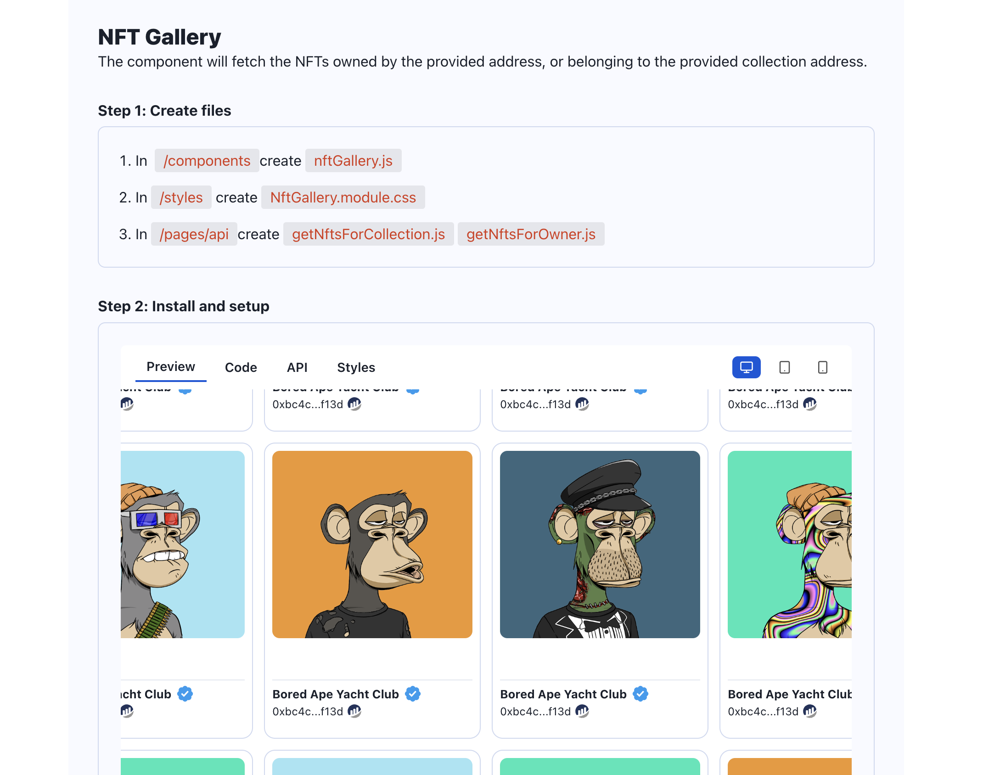

Everything you need to create Web3 Dapps in 4 minutes.

This package includes the global command to start the Create Web3 DApp CLI builder.

Please refer to this package's documentation and the following links for an in depth explanation:

-   [Docs](https://docs.alchemy.com/docs/create-web3-dapp) - Everything you need to know when using CW3D
-   [GitHub](https://github.com/alchemyplatform/create-web3-dapp) - look at the extensive code example or start contributing
-   [Website](https://createweb3dapp.alchemy.com) - Learn more about CW3D and add components to your project
-   [Templates](https://createweb3dapp.alchemy.com/#templates) - Check out the pre-built project templates
-   [Components Library](https://createweb3dapp.alchemy.com/#components) - Add features directly to your project through components
-   [Community](https://t.me/createweb3dapp) - Meet other builders, get support, and give feedback!

</br>

## What is create-web3-dapp?

create-web3-dapp is an npx tool that allows developers to **create any web3 application in ~4 minutes.**

The dapp created with create-web3-dapp are NextJS-based, and **compatible with the most used blockchains such as Ethereum, Polygon, Optimism, Arbitrum, and Solana**. Create-web3-dapp allows web3 developers to build production-ready decentralized applications at lightning speed, using pre-made React components, webhooks, and APIs.

No configuration or complicated folder structures, only the files you need to build your Dapp.<br>

---

</br>

## Usage

```
npx create-web3-dapp@latest
```

If you've previously installed `create-web3-dapp` globally via `npx create-web3-dapp`, the CLI builder will notify you if a new version has been released. In any case, we suggest you to run using the latest available version by running `npx create-web3-dapp@latest`.

_([npx](https://medium.com/@maybekatz/introducing-npx-an-npm-package-runner-55f7d4bd282b) comes with npm 5.2+ and higher, see [instructions for older npm versions](https://gist.github.com/gaearon/4064d3c23a77c74a3614c498a8bb1c5f))_

---

</br>

## Quick Start

To create a new app:

1. In your terminal run:

```sh
  npx create-web3-dapp@latest
```

2. Select and create the dependencies, components, and contracts you want to include in your web3 application.

Create Web3 Dapp will then create a directory containing both the files and the dependencies you'll need to kickstart your project<br>

```sh
npx create-web3-dapp@latest
cd my-create-web3-dapp
npm run dev
```

In case you've installed a blockchain development environment, navigate to the frontend folder before running npm run dev.

Now navigate on [http://localhost:3000/](http://localhost:3000/) to see your dapp.<br>

Next, learn how to add a web3 ready component from the create-web3-dapp library.

---

</br>

## Components Library

Create Web3 Dapp allows the developers to prototype their DApps in minutes using a production-ready responsive React components library. The components work best inside create-web3-dapp projects, but are compatible with any NextJS project.



To learn how to implement a component in your create-web3-dapp application, visit the cw3d [components documentation](https://docs.alchemy.com/docs/create-web3-dapp-components)

---

</br>
cd
## Folder Structure

### Without Blockchain Development Environment

```
📦Root
 ┣ 📂.vscode
 ┃ ┗ 📜settings.json
 ┣ 📂backend
 ┃ ┣ 📂contracts
 ┃ ┃ ┗ 📜MyContract.sol
 ┃ ┣ 📂scripts
 ┃ ┃ ┗ 📜MyContract_deploy.js
 ┃ ┣ 📂test
 ┃ ┃ ┗ 📜Lock.js
 ┃ ┣ 📜.env.local
 ┃ ┣ 📜hardhat.config.js
 ┃ ┣ 📜package-lock.json
 ┃ ┗ 📜package.json
 ┣ 📂frontend
 ┃┣ 📂components
 ┃ ┃┣ 📂navigation
 ┃ ┃ ┗ 📜navbar.jsx
 ┃  ┃┗ 📜InstructionsComponent.jsx
 ┃┣ 📂layout
 ┃┃ ┗ 📜mainLayout.jsx
 ┃┣ 📂pages
 ┃┃ ┣ 📂api
 ┃┃ ┣ 📜_app.js
 ┃┃ ┗ 📜index.jsx
 ┃┣ 📂public
 ┃┃ ┗ 📜alchemy_logo.svg
 ┃┣ 📂styles
 ┃┃ ┣ 📜Home.module.css
 ┃┃ ┣ 📜Navbar.module.css
 ┃┃ ┣ 📜InstructionsComponent.module.css
 ┃┃ ┗ 📜globals.css
 ┃┣ 📜.env.local
 ┃┣ 📜.gitignore
 ┃┣ 📜next.config.js
 ┃ ┣ 📜package-lock.json
 ┃ ┗ 📜package.json
 ┣ 📜.DS_Store
 ┣ 📜.env.local
 ┣ 📜.gitignore
 ┣ 📜LICENSE
 ┗ 📜README.md
```

### With Blockchain Development Environment

```
📦Root
 ┣ 📂components
 ┃ ┣ 📂navigation
 ┃ ┃ ┗ 📜navbar.jsx
 ┃ ┗ 📜InstructionsComponent.jsx
 ┣ 📂layout
 ┃ ┗ 📜mainLayout.jsx
 ┣ 📂pages
 ┃ ┣ 📂api
 ┃ ┣ 📜_app.js
 ┃ ┗ 📜index.jsx
 ┣ 📂public
 ┃ ┗ 📜alchemy_logo.svg
 ┣ 📂styles
 ┃ ┣ 📜Home.module.css
 ┃ ┣ 📜Navbar.module.css
 ┃ ┣ 📜InstructionsComponent.module.css
 ┃ ┗ 📜globals.css
 ┣ 📜.env.local
 ┣ 📜.gitignore
 ┣ 📜next.config.js
 ┣ 📜package-lock.json
 ┗ 📜package.json

```


